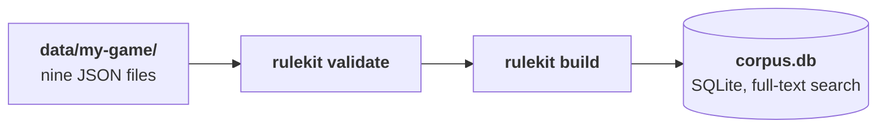
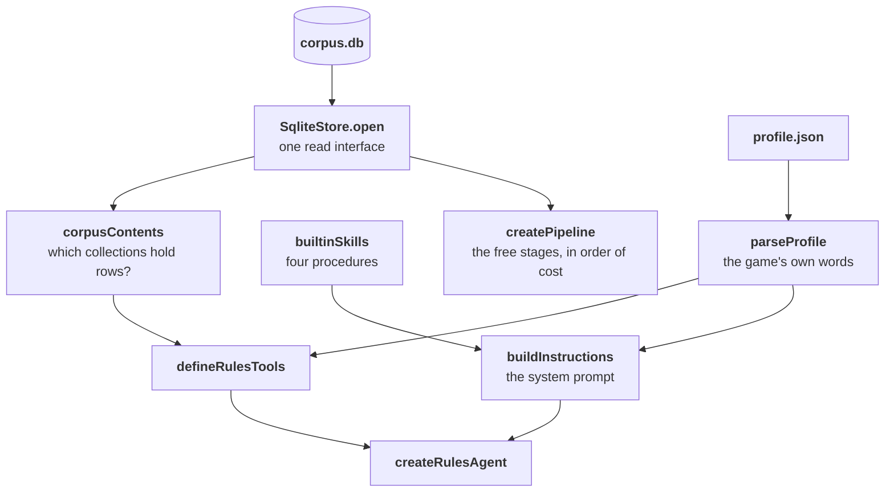
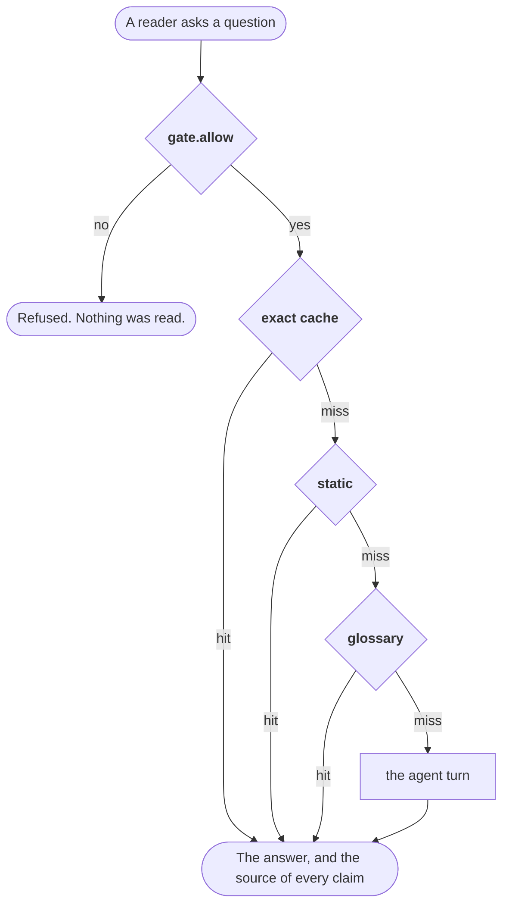
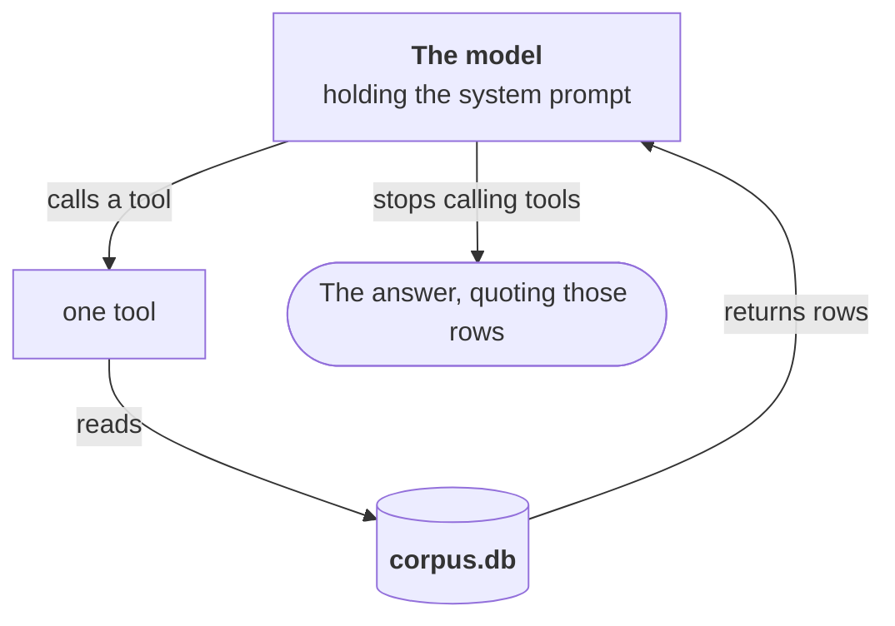

# Architecture

Four diagrams, one for each concern. Only the fourth one costs a model call.

## 1. The command compiles a corpus, one time



No model runs in this step, and the command fetches nothing. The file
`profile.json` sits in the same directory. A server reads it at start up, and
the build does not compile it into the database.

[The corpus format](corpus-format.md) states every field of those files.

## 2. The code makes an agent, one time for each server process



The corpus is a file. This step takes milliseconds, and it needs no database
server.

The file `examples/next-app/app/lib/rulekit.ts` is this diagram as code.

## 3. A question goes through the free stages



The pipeline uses the first stage that can answer. The gate runs before every
stage, so a refusal reads nothing and costs nothing.

If a stage fails, the run continues to the next stage. The pipeline reports the
failure, and it hides nothing. A broken stage returns nothing. A healthy stage
with nothing to say also returns nothing. The report is the only way to separate
the two conditions.

Two more stages are available, and this project ships them in the off state.
Each one needs an account that you can prefer to avoid: a semantic cache, and a
step that uses a cheap model.

## 4. The agent turn



Each pass through this loop is one model call. The turn ends when the model
writes an answer and calls no tool.

| The tools | When the agent offers them |
|---|---|
| `search_all`, `search_rules`, `get_rule`, `get_rule_context`, `search_terms`, `list_rulebooks`, `list_sections` | Always |
| `list_errata`, `list_banlist`, `list_patch_notes`, `list_rulings` | When that collection holds a row |
| `search_cards`, `get_cards` | When the profile permits cards |
| `list_references`, `fetch_reference` | When the implementer named a reference site |
| A caller's own tools | When the caller passes `extraTools`. See [custom tools](custom-tools.md) |

This project sets no limit on the number of steps in one turn. A limit is a cost
control, and the cost is your decision, so set `stepCap` if you pay for each
token. A turn that reaches the limit stops at once. It gives the reader only the
text that the model wrote before that point, and that text can be part of a
sentence.

### Reading a site outside the corpus

The last row of the table is the only part of this project that opens a socket
to anything except the model. It stays off until somebody switches it on.

```mermaid
flowchart TB
    MODEL["`**The model**`"] -->|"the corpus tools missed"| FETCH["fetch_reference"]
    FETCH -->|"checks the address"| GATE{"https? a listed host?"}
    GATE -->|"no"| REFUSE(["a refusal the model reads"])
    GATE -->|"yes"| SITE[("a site the implementer named")]
    SITE -->|"page text"| MODEL
    FETCH -->|"marks the step"| TRACE(["`source` on the trace step"])
    TRACE --> READER(["The reader sees: outside the rules data"])
```

**rulekit names no site and endorses none.** The hosts arrive through
`createRulesAgent({ references })`, which is a runtime option and never a corpus
field. [Reference sites](reference-sites.md) covers the whole step, and
[design decisions](design-decisions.md) gives the reasons for that placement.

## Three decisions that the diagrams show

1. **The profile supplies both the tools and the prompt.** It decides the name
   of a tool, and it tells the model what a printed value means. A chess tool
   therefore says "piece", and it never says "card".
2. **The agent offers a tool only when the corpus can answer with it.** The
   function `corpusContents` counts the rows first. A game with an empty banned
   list gets no banned-list tool.
3. **A skill is one page that the model reads for one type of question.** The
   four skills in this project cover a card, a published ruling, two things at
   the same time, and order and timing. The agent drops a skill when its tools
   do not exist: a corpus with no cards gets no `card_lookup` skill, and a
   corpus with no rulings gets no `rulings_lookup` skill. A procedure that names
   an absent tool teaches the model to call it.
