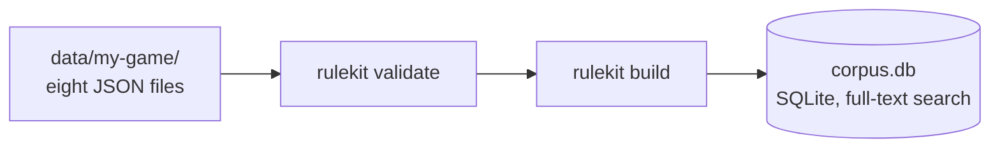
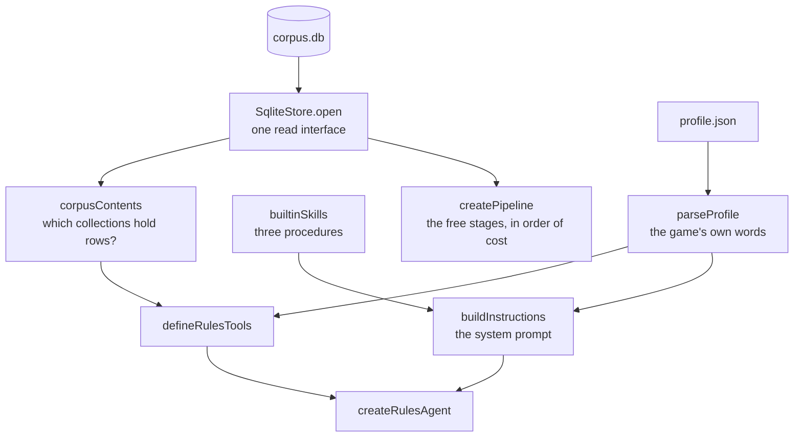
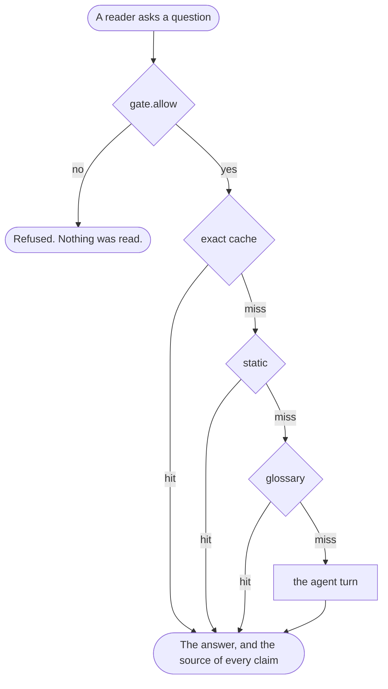

# Architecture

Four diagrams, one per concern. Only the last one costs a model call.

## 1. A corpus is compiled, once

No model runs here, and nothing is fetched. `profile.json` sits beside those
files and is read when a server starts, not compiled into the database.

`docs/corpus-format.md` states every field of those eight files.

## 2. An agent is born, once per server process

The corpus is a file, so this takes milliseconds and needs no database server.

`examples/next-app/app/lib/rulekit.ts` is this diagram as code, in 60 lines.

## 3. A question walks the free stages

The first stage that can answer wins. The gate runs before every stage, so a
refusal reads nothing and costs nothing.

A stage that fails degrades to a miss and the run continues. The failure is
reported, never swallowed: a stage that returns nothing while broken looks
exactly like a stage with nothing to say, and the difference is the whole
diagnosis.

Two more stages ship switched off, because each needs an account you may not
want: a semantic cache, and a pass with a cheap model.

## 4. The agent turn

Each pass around the loop is one model call. The turn ends by itself when the
model answers without calling a tool.

| The tools | When they are offered |
|---|---|
| `search_all`, `search_rules`, `get_rule`, `get_rule_context`, `search_terms`, `list_rulebooks`, `list_sections` | Always |
| `list_errata`, `list_banlist`, `list_patch_notes` | When that collection holds a row |
| `search_cards`, `get_cards` | When the profile enables cards |

No ceiling is set on the steps one turn may take. A turn ends when the model
answers. A cap is a cost control, and cost is your decision, so set `stepCap`
when you pay per token. A capped turn hands the reader whatever was written
when the ceiling hit, which can be half a sentence.

## Three decisions the diagrams show

1. **The profile reaches both the tools and the prompt.** It decides what a tool
   is called and what the model is told a printed value means, so a chess tool
   says "piece" and never "card".
2. **A tool exists only when the corpus can answer with it.** `corpusContents`
   counts the rows first. A game with an empty banned list is never given a
   banned-list tool.
3. **A skill is a page the model reads for one shape of question.** The three
   that ship cover reading a card, two things at once, and order and timing.
   `card_lookup` is left out when a corpus holds no cards.
