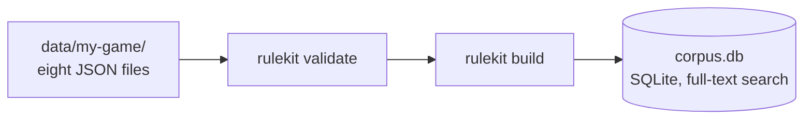
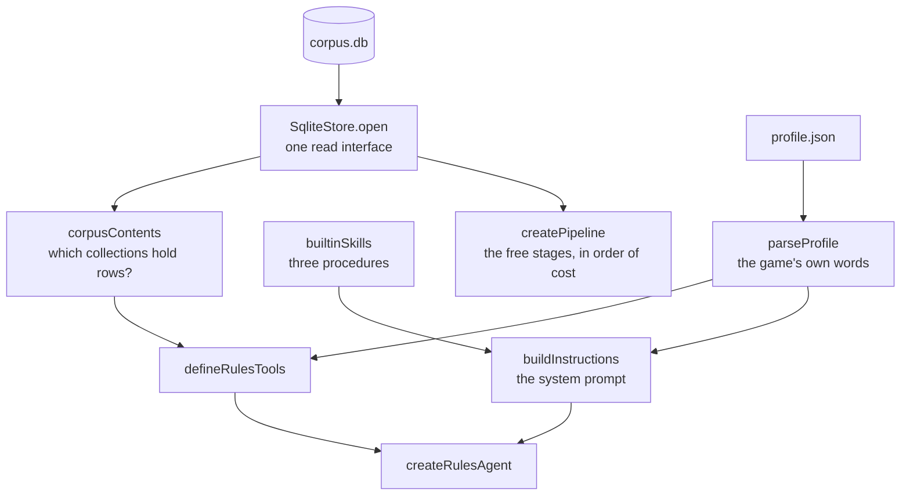
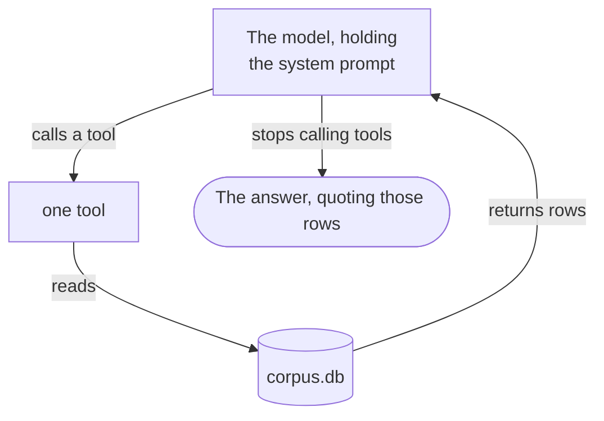

# Architecture

Four diagrams, one for each concern. Only the fourth one costs a model call.

## 1. The command compiles a corpus, one time

No model runs in this step, and the command fetches nothing. The file
`profile.json` is in the same directory. A server reads it at start up, and the
build does not compile it into the database.

The file `docs/corpus-format.md` states every field of those eight files.

## 2. The code makes an agent, one time for each server process

The corpus is a file. This step takes milliseconds, and it needs no database
server.

The file `examples/next-app/app/lib/rulekit.ts` is this diagram as code, in 60
lines.

## 3. A question goes through the free stages

The pipeline uses the first stage that can answer. The gate runs before every
stage, so a refusal reads nothing and costs nothing.

If a stage fails, the run continues to the next stage. The pipeline reports the
failure, and it does not hide it. A broken stage returns nothing. A healthy
stage with nothing to say also returns nothing. The report is the only way to
tell the two conditions apart.

Two more stages are available, and this project ships them in the off state.
Each one needs an account that you can prefer to avoid: a semantic cache, and a
step that uses a cheap model.

## 4. The agent turn

Each pass through this loop is one model call. The turn ends when the model
writes an answer and calls no tool.

| The tools | When the agent offers them |
|---|---|
| `search_all`, `search_rules`, `get_rule`, `get_rule_context`, `search_terms`, `list_rulebooks`, `list_sections` | Always |
| `list_errata`, `list_banlist`, `list_patch_notes` | When that collection holds a row |
| `search_cards`, `get_cards` | When the profile permits cards |

This project sets no limit on the number of steps in one turn. A turn ends when
the model writes an answer. A limit is a cost control, and the cost is your
decision, so set `stepCap` if you pay for each token. A turn that reaches the
limit stops immediately. It gives the reader only the text that the model wrote
before that point, and that text can be a part of a sentence.

## Three decisions that the diagrams show

1. **The profile supplies both the tools and the prompt.** It decides the name
   of a tool, and it tells the model what a printed value means. A chess tool
   therefore says "piece", and it never says "card".
2. **The agent offers a tool only when the corpus can answer with it.** The
   function `corpusContents` counts the rows first. A game with an empty banned
   list gets no banned-list tool.
3. **A skill is one page that the model reads for one type of question.** The
   three skills in this project cover a card, two things at the same time, and
   order and timing. A corpus with no cards does not get the `card_lookup`
   skill.
